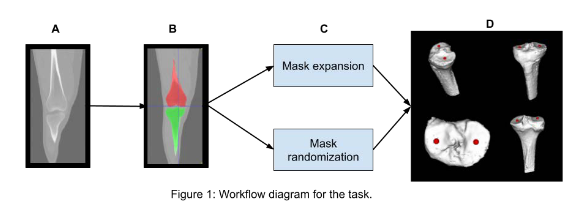

# Medical_Image_Processing
This repository demostrates the medical image processing according to the Task:1 'Image processing' for the selection process of Research assistant(RA) at Naamii.

## Overview of task. 
This  project  focuses  on  bone  segmentation  in  3D  CT  images  volume.  Task  is  to  process  a  specific  
bone region as outlined in the task description and ultimately identify a key anatomical landmark. 

## Data
The provide data is in NIfTI (Neuroimaging Informatics Technology Initiative) is a file format commonly used in medical imaging, particularly for MRI and CT scan data. 

#### Data Analysis

- Volume Dimensions: Shape: (512, 512, 216) - This is a high-resolution volume with 512×512 pixels in each slice and 216 slices total

- Value Range: Range: [-3024.0, 1769.0] - This appears to be in Hounsfield Units (HU), which is standard for CT scans
Bone typically has values above 300-400 HU, while soft tissue is generally between -100 and 100 HU
### Axial view animation

### MIP (Maximum Intensity Projection)

From the MIP Images:

- The bones are clearly visible with good contrast
-Both femur (thigh bone) and tibia (shin bone) are well-defined in the sagittal and coronal views
- The knee joint is clearly visible where they meet
- The circular view in the axial MIP indicates a good cross-sectional capture of the joint
### Histogram of voxel intensities

From the Histogram (Image 2):

- There are distinct peaks in the histogram, indicating different tissue types
- The suggested threshold (15.00) seems to be between soft tissue and bone peaks
- There's a large peak at around -1000 HU (likely representing air)
- There appears to be another peak at around -3000 HU (could be outside the scan field)
- The bone intensities appear to be in the positive range, likely from about 200-1800 HU

## Task 1.1 – Bone Segmentation 
First task is to segment the femur and tibia regions from the provided CT image, as illustrated in Figure 
1.B and save as nii.gz format. Apply only image processing techniques. 

Based on Data analysis, here's how we should approach the bone segmentation:

**Preprocessing**

- Apply a Gaussian filter to reduce noise while preserving edges

**Thresholding**

- From the histogram, we can see that a threshold around 200-300 HU would likely separate bone from soft tissue
- After testing 200 HU is best
**Morphological Operations**
- Fills small holes and smooths the mask using binary closing and custom operations (via apply_morphological_operations from utils).

**Separation of Femur and Tibia**

- After thresholding, we'll need to separate the two bones. This can be done using connected component analysis. Label connected components in the bone mask.
- Filter out small components based on a minimum size.
- There was only one component i.e. bone.
- Use 3D Bounding Box + Heuristic Z-Split: Extract bounding box of the largest component. Define a split plane at 40–50% of the bounding box height. Split the bone into upper (femur) and lower (tibia) based on this threshold.Assign the top half to femur and bottom to tibia.

- This approach is deterministic, simple, and more robust for knee CTs. Finally after experimentaion the optimum is 50%.

Label connected components in the bone mask.

**Post-processing**

- Apply morphological operations (opening/closing) to remove small isolated regions and fill holes
- Use region properties to ensure we've correctly identified femur and tibia based on their shape and position

**Output Generation**
- Saves the segmentation results as NIfTI files (.nii.gz format) as required, creates three output files: Femur segmentation, Tibia segmentation and Combined segmentation with labels (1 for femur, 2 for tibia)
**Visualization**

- Provides visualization functions to examine the segmentation results
- Shows slices from different anatomical planes
- Overlays segmentation on original data for easy assessment
**Segmentation Output**
1. **Coronal View**

2. **Animation** wait for slice around 250

## Task 1.2 – Contour Expansion 
- The second task requires to expand the segmented mask by 2 mm uniformly outward. 2mm should be 
parameter. 
### Key Features
**Accurate Distance-Based Expansion**
- Voxel Spacing Calculation: Extracts the real-world voxel dimensions from the NIfTI affine matrix
- Millimeter to Voxel Conversion: Converts the 2mm expansion distance to appropriate voxel units for each dimension
- Spherical Structuring Element: Creates a proper 3D spherical kernel for uniform expansion

**Parameterized Expansion**
- The expansion_mm parameter is configurable (default: 2.0mm) as required by the task
- Can easily be changed to any other value for different expansion distances

**Robust Morphological Operations**
- Uses binary_dilation with a custom spherical structuring element
- Handles anisotropic voxel spacing (different resolutions in x, y, z directions)
- Ensures truly uniform expansion in real-world coordinates

**Overlap Handling**
- Detects and handles overlapping regions between expanded femur and tibia masks
- Preserves original bone assignments in overlapping areas
- Provides detailed reporting of overlap statistics

**Comprehensive Visualization**
- Contour-based Visualization: Shows original contours in red and expanded contours in blue
- Multi-plane Views: Displays results in axial and coronal planes
- Before/After Comparison: Clear visualization of the expansion effect

**Complete Pipeline Integration**
- Saves results in NII.GZ format as required
### Outputs
**Axial view**

**Coronal View of Femur**

**Coronal View of Tibia**

## Task 1.3 – Randomized Contour Adjustment 
The third task involves randomizing the expanded segmented mask such that: 
- The new mask lies between the original segmentation mask and the 2 mm expanded mask. 
- The randomized mask must not exceed the 2 mm expansion limit. 
- The contour must not shrink below the original segmentation contour. 
- 2 mm and random value should be parameter. 

**Advanced Randomization Algorithm**

- Distance-Based Probability: Uses distance transform to create realistic random variations
- Smooth Random Fields: Applies Gaussian smoothing to create coherent random patterns (not just noise)
- Probability Weighting: Combines distance-based and random factors for realistic results
- Multiple Random Seeds: Generates different randomized masks with different random seeds

**Morphological Refinement**

- Contour Smoothing: Applies morphological operations to smooth the randomized contours
- Overlap Resolution: Handles overlapping regions between femur and tibia intelligently
- Quality Control: Ensures the randomized masks maintain anatomical plausibility

**Comprehensive Visualization**

- Multi-Mask Comparison: Shows original (red), expanded (blue), and randomized (green/orange) contours
- Multiple Views: Displays results in both axial and coronal planes
- Clear Differentiation: Uses different colors for easy identification of different masks
### Outputs
**Axial view**

**Coronal View of Femur**

**Coronal View of Tibia**

## Task 1.4 – Landmark Detection on Tibia 
The final task focuses on the tibia. You are required to: 
- Required to save the following segmentation masks in .nii.gz file: 
    - Original Mask 
    - 2 mm Expanded Mask 
    - 4 mm Expanded Mask 
    - Randomized Mask 1 
    - Randomized Mask 2 
- Identify the medial and lateral lowest points on the tibial surface, as demonstrated in Figure 1.D for 
all the above 5 masks. Please note that Figure 1.D is provided for illustration purposes only. You are 
not  required  to  generate  this  image  as  part  of  your  submission.  Our  team  has  tools  for  this 
visualization. 
- Submit the coordinates of these points for evaluation we will compare your results with the ground 
truth. 